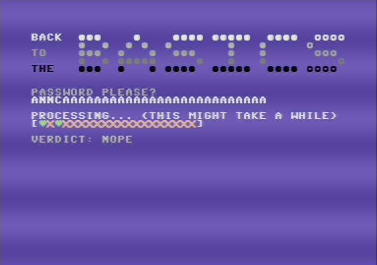

# Back To The Basics

> You won't find any assembly in this challenge, only C64 BASIC. Once you get the password, the flag is CTF{password}. P.S. The challenge has been tested on the VICE emulator.

[crackme.prg]()

## Setting Up The Environment

As suggested by the writer, we downloaded the VICE Commodore 64 emulator (which is an awesome project by itself). 


Loading a game on the emulator is easy - just left click -> `Smart-attach disk/tape...` 

After the disk loads you generally have 2 commands available - `LIST` and `RUN`

Entering `RUN` executes the program and prints the challenge on screen. After the verdict the program doesn't end and you have to reset the emulator.


Running `LIST` prints a BASIC program


VICE lets you redirect the terminal output to a file:

```basic
1 REM ======================
2 REM === BACK TO BASICS ===
3 REM ======================
10 PRINTCHR$(155):PRINTCHR$(147)
20 POKE 53280, 6:POKE 53281, 6:
25 PRINT"LOADING..."
30 DATA 2,1,3,11,32,32,81,81,81,32,32,32,32,81,32,32,32,32,81,81,81,81,32,
81,81,81,81,81,32,32,81,81,81,81,32,32,87,87,87,87
31 DATA 32,32,32,32,32,32,81,32,32,81,32,32,81,32,81,32,32,81,32,32,32,32,
32,32,32,81,32,32,32,81,32,32,32,32,32,87,32,32,32,32
32 DATA 20,15,32,32,32,32,81,81,81,32,32,81,32,32,32,81,32,32,81,81,81,32,
32,32,32,81,32,32,32,81,32,32,32,32,32,32,87,87,87,32
33 DATA 32,32,32,32,32,32,81,32,32,81,32,81,81,81,81,81,32,32,32,32,32,81,
32,32,32,81,32,32,32,81,32,32,32,32,32,32,32,32,32,87
34 DATA 20,8,5,32,32,32,81,81,81,32,32,81,32,32,32,81,32,81,81,81,81,32,32
,81,81,81,81,81,32,32,81,81,81,81,32,87,87,87,87,32
40 FOR I = 0 TO 39: POKE 55296 + I, 1: NEXT I
41 FOR I = 40 TO 79: POKE 55296 + I, 15: NEXT I
42 FOR I = 80 TO 119: POKE 55296 + I, 12: NEXT I
43 FOR I = 120 TO 159: POKE 55296 + I, 11: NEXT I
44 FOR I = 160 TO 199: POKE 55296 + I, 0: NEXT I
50 FOR I = 0 TO 199
51 READ C : POKE 1024 + I, C
52 NEXT I
60 PRINT:PRINT:PRINT:PRINT:PRINT
70 POKE 19,1: PRINT"PASSWORD PLEASE?" CHR$(5): INPUT ""; P$: POKE 19,0
80 PRINT:PRINT:PRINTCHR$(155) "PROCESSING... (THIS MIGHT TAKE A WHILE)":PR
INT"[                    ]"
90 CHKOFF = 11 * 40 + 1
200 IF LEN(P$) = 30 THEN GOTO 250
210 POKE 1024 + CHKOFF + 0, 86:POKE 55296 + CHKOFF + 0, 10
220 GOTO 31337
250 POKE 1024 + CHKOFF + 0, 83:POKE 55296 + CHKOFF + 0, 5
2000 REM NEVER GONNA GIVE YOU UP
2001 REM
2010 POKE 03397, 00199 : POKE 03398, 00013 : GOTO 2001
31337 PRINT:PRINT"VERDICT: NOPE":GOTO 31345
31345 GOTO 31345
```

It took us some time to understand what is the text we're seeing on screen - It turns out that the BASIC interpreter has a feature of printing the code of the program it currently holds in memory.

Looking at the code, it seems that the skeleton code of the challenge is printed but the logic that validates the flag itself is missing. We assumed that some measures were taken by the author to hide the important parts.

However, the first check is present - the string's length should be 30. The validation program runs very slowly and increasing the speed of VICE was helpful. As you can see this time we get one green ♥ and 19 red Xs 


We tried to think of ways to extract the important code - what we did first was to use the built in debugger of VICE (left click -> `Activate monitor`). We searched strings from the file in the memory and found that the entire `.prg` file is loaded as-is in addresses `7ff` to `87bf`. Next, we placed an execute breakpoint on this entire memory section - but only read/write breakpoints were actually breaking - with backtraces leading to the kernel rom and not the program itself. After some time we got to the conclusion that BASIC on c64 is interpreted, which also explained the `LIST` decompilation feature, and made perfect sense.

Our next idea was to remove the infinite loop at the end of the program (```31345 GOTO 31345```) and run `LIST` after the program finishes.

A C64 BASIC program is represented by a combination of "[Tokens](https://www.c64-wiki.com/wiki/BASIC_token)" and strings. Specifically the goto line looks like this when compiled - `\x89 31345`. We changed it to `\x80` which is the `END` token.

This time the program exited but the `LIST` output was the same. We decided to replace other arbitrary `\x89 <label>`s through out the file with `\x80` - maybe we could exit while some other "hidden" code is loaded.

This time we got 2 additional lines:
```basic
2004 ES = 05363 : EE = 06632 : EK = 152
2005 FOR I = ES TO EE : K = ( PEEK(I) + EK ) AND 255 : POKE I, K : NEXT I
```

Which looks like the encryption algorithm we looked for. Subtracting `0x7ff` from ES/EE and writing a small python script that adds 152 mod 255 to every byte in that range allowed us to extract a chunk of decrypted BASIC code from the file:


Trying to load+list the modified file didn't show any new code - but we managed to decompile it using a tool called C64List.

 Now we got a new piece of code that looked like part of the flag validation algorithm:

```basic
30 V = 0.6666666666612316235641 - 0.00000000023283064365386962890625 : G = 0
2020 BA = ASC( MID$(P$, 2, 1) )
2021 BB = ASC( MID$(P$, 3, 1) )
2022 BC = ASC( MID$(P$, 4, 1) )
2025 P0 = 0:P1 = 0:P2 = 0:P3 = 0:P4 = 0:P5 = 0:P6 = 0:P7 = 0:P8 = 0:P9 = 0:PA = 0:PB = 0:PC = 0
2030 IF BA AND 32 THEN P0 = 0.062500000001818989403545856475830078125
2031 IF BA AND 64 THEN P1 = 0.0156250000004547473508864641189575195312
2032 IF BA AND 128 THEN P2 = 0.0039062500001136868377216160297393798828
2033 IF BB AND 1 THEN P3 = 0.0009765625000284217094304040074348449707
2034 IF BB AND 2 THEN P4 = 0.0002441406250071054273576010018587112427
2035 IF BB AND 4 THEN P5 = 0.0000610351562517763568394002504646778107
2036 IF BB AND 8 THEN P6 = 0.0000152587890629440892098500626161694527
2037 IF BB AND 16 THEN P7 = 0.0000038146972657360223024625156540423632
2040 IF BB AND 32 THEN P8 = 0.0000009536743164340055756156289135105908
2031 IF BB AND 64 THEN P9 = 0.0000002384185791085013939039072283776477
2032 IF BB AND 128 THEN PA = 0.0000000596046447771253484759768070944119
2033 IF BC AND 1 THEN PB = 0.000000014901161194281337118994201773603
2034 IF BC AND 2 THEN PC = 0.0000000037252902985703342797485504434007
2050 K = V + P0 + P1 + P2 + P3 + P4 + P5 + P6 + P7 + P8 + P9 + PA + PB + PC
2060 G = 0.682612358126820
2100 T1 = K = G : A = 86 : B = 10
2200 IF T1 = -1 THEN A = 83 : B = 5
```
We can see that the code takes 3 chars from a string (BA, BB, BC) and does some calculations on them - specifically the sum of a subset of (P0,..,Pc) should be equal `(G-V)` and that subset is determined by the bits of the extracted chars - `(BA AND 32) * P0 + (BA AND 64) * P1 + ...`

We wrote script for calculating the correct subset - and we managed to get another heart:



Now that we knew the verification algorithm we needed to find the other 18 parts.
We assumed there aren't any major variations in the decrypt/verify methods so we wrote a program to try all 255 possible key values (on the entire file) and search for the strings `P0,P1,...` in the file - this way we extracted the other 18 verification snippets and their keys.

After about an hour of manual work using some helper scripts and some guesses we managed to complete the flag


(Since we didn't see any linked lists during the solve we think the intended solution was a bit different than ours :)

